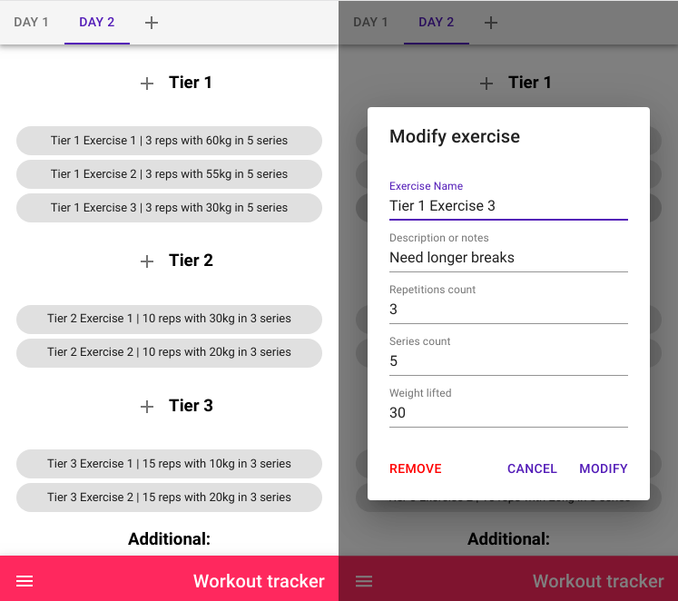

First bigger mobile-first React app that I designed and built from scratch completely on my own. Its purpose is to log workouts. After creating a routine, it is very easy to log exercises and modify them on the fly. Features very clear interface, stores data offline on localStorage. There is still a lot to do (like drag and drop functionality, preset exercise names, confirmation dialog on removing exercise), but it is already a MVP. Deployed on Netlify.

**Live version:**

[https://workouttracker.szymonpulut.com](https://workouttracker.szymonpulut.com)

**GitHub repository:**

[https://github.com/szymonpulut/workouttracker](https://github.com/szymonpulut/workouttracker)
